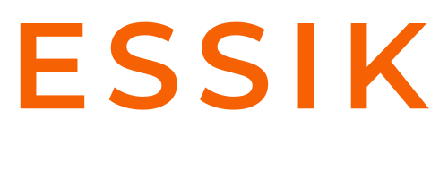

<div align="center">


<br/>

<br/>

<br/>


### Innovation • Technologie • Transformation digitale

**BUILD. AUTOMATE. GROW.**

<sub>Software • AI • Automation • Digital Marketing</sub>

<br/>


</div>

<br/>

## Qui sommes-nous ?

**Essik Network SARL** est une entreprise marocaine spécialisée dans les technologies digitales et le développement de solutions informatiques sur mesure.

À travers son activité **Essik Network**, l'entreprise accompagne depuis **2015** les entreprises, organisations et startups dans leur transformation digitale : développement logiciel, systèmes d'information, applications digitales et marketing numérique.

> Transformer les idées et les besoins métiers en solutions technologiques concrètes, performantes et durables.

<br/>

## Notre vision

Évoluer d'une agence digitale traditionnelle vers un **acteur technologique** proposant des produits SaaS, des systèmes d'information métier et des solutions innovantes — capable de digitaliser, automatiser et centraliser les opérations de ses clients.

```
Services technologiques  →  Solutions métier  →  Produits SaaS
```

<br/>

## Domaines d'expertise

<table>
<tr>
<td width="33%" valign="top">

### Développement logiciel
- Applications Web
- Applications Mobile
- Applications Desktop
- API & architectures backend
- Plateformes SaaS
- Systèmes de gestion métier
- Solutions e-commerce

</td>
<td width="33%" valign="top">

### Systèmes d'information
- CRM
- Gestion commerciale
- Gestion des ressources humaines
- Finance & facturation
- Gestion documentaire
- Tableaux de bord & statistiques
- Automatisation des processus

</td>
<td width="33%" valign="top">

### Solutions digitales
- Création de sites Web
- E-commerce
- UI/UX Design
- SEO
- Marketing digital
- Réseaux sociaux
- Production média

</td>
</tr>
</table>

<br/>

## Solutions spécialisées

Parmi nos projets phares : un **Système d'Information Hospitalier** dédié aux centres d'hémodialyse — gestion des dossiers patients, des séances, des rapports, des statistiques, des alertes et applications destinées aux professionnels de santé.

<br/>

## Notre approche

| Étape | Description |
|---|---|
| **1. Analyse** | Comprendre les processus, les contraintes et les objectifs du client |
| **2. Conception** | Définir l'architecture, l'expérience utilisateur et les fonctionnalités |
| **3. Développement** | Construire une solution moderne, performante et évolutive |
| **4. Déploiement** | Mettre la solution en production et l'intégrer chez le client |
| **5. Accompagnement** | Assurer la maintenance, le support et l'évolution dans le temps |

<br/>

## Secteurs d'intervention

`Entreprises & PME` `Commerce & e-commerce` `Santé` `Éducation` `Industrie` `Services` `Startups` `Organisations & institutions`

<br/>

## Nos engagements

| | |
|---|---|
| **Innovation** | Adopter des technologies adaptées aux besoins actuels et futurs |
| **Performance** | Développer des solutions rapides, efficaces et optimisées |
| **Sécurité** | Protéger les systèmes et les données de nos clients |
| **Évolutivité** | Concevoir des solutions capables d'évoluer avec l'entreprise |
| **Accompagnement** | Construire une relation durable au-delà de la livraison |

<br/>

## Équipe

Essik Network s'appuie sur des compétences complémentaires : direction & management, développement full-stack, développement backend, design, marketing, photographie/vidéographie, SEO & analyse digitale.

**EL MEHDI ESSIK** — *Founder & CEO* -> [linkedin](https://www.linkedin.com/in/elmehdiessik2/)<br/>
**ZAKARIAE MACHICHE** — *Co-Founder & Markter* -> [linkedin](https://www.linkedin.com/in/zakariae-machiche-9838b738b)<br/>
**YASSINE BENHAIDA** — *Project Manager* -> [linkedin](https://www.linkedin.com/in/yassine-benhaida-431999419)<br/>
**YAHYA SAADI** — *Wp Developer* -> [linkedin](https://www.linkedin.com/in/saadi-yahya-9a543b42a?utm_source=share_via&utm_content=profile&utm_medium=member_android)<br/>


<br/>

## Fiche d'identité

| | |
|---|---|
| **Secteur** | Technologie • IT • Digital • SaaS |
| **Activité** | Développement logiciel et transformation digitale |
| **Marché** | Maroc et international |
| **Marque digitale** | Essik Network |
| **Direction** | EL MEHDI ESSIK — Founder & CEO |
| **Depuis** | 2015 |

<br/>

## Contact

<div align="center">

[contact@essiknetwork.com](mailto:essiknetwork@gmail.com) &nbsp;•&nbsp; +212 5 233-088 02 &nbsp;•&nbsp; Maroc

<br/><br/>

<sub>© 2015–2026 Essik Network SARL — Tous droits réservés</sub>

</div>
